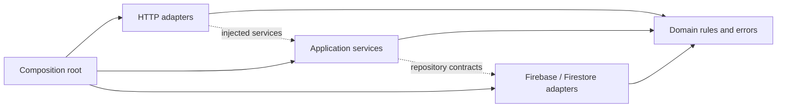

# Architecture

Planto has two runtime boundaries: a React browser application and a Node.js HTTP
server backed by Firestore Standard. The root package manages a single installation
and deployment; frontend and backend source never import each other.

## Layout

```text
.env                         One local configuration file, ignored by Git
.env.example                 Portable configuration template
frontend/
  src/
    main.tsx                 Browser entry point
    app/                     Providers, routing, store composition, integration tests
    pages/                   Route screens
    widgets/                 Header, footer, home sections, reusable not-found view
    features/                Admin access, cart drawer, product form, filters, newsletter
    entities/                Product, category, review, cart types/state/UI
    shared/                  UI primitives, HTTP client, Firebase configuration, i18n
  test/                      Test setup, MSW handlers, in-memory fixtures and auth doubles
  public/                    Static images, icons and robots.txt
backend/
  src/
    server.js                Process startup and graceful shutdown
    bootstrap.js             Composition root: constructs and connects dependencies
    config.js                Validates explicitly supplied environment values
    domain/                  Validation, product rules, image decoding, error codes
    application/             Use cases with injected repository/auth dependencies
    infrastructure/          Firebase token verifier and Firestore REST adapters
    http/                    Routing, request parsing, CORS, error mapping, static files
  test/                      Domain, service, repository, HTTP and configuration tests
  seed.json                  Initial catalog data
  firestore.rules.template   Versioned Firestore rules without account values
  firestore.rules            Generated local rules; ignored by Git
scripts/                     Development, architecture checks and maintenance tools
e2e/                         Browser journeys against an isolated test server
docs/history/                Earlier design decisions and migration notes
```

## Backend dependencies



Solid arrows are source imports; dotted arrows are dependencies passed at startup.
Application services know repository operations, not Firebase URLs, document encodings,
HTTP status codes, or global configuration. See `backend/src/application/README.md` for
repository contracts. Small factory functions implement dependency injection without
an additional framework or a hierarchy of base classes.

- **Domain** validates product fields and images, derives slugs, and selects catalog results.
  It has no network, filesystem, environment, HTTP or Firebase dependency.
- **Application** owns CRUD workflows, category checks, unique slug selection, newsletter
  normalization, administrator authorization and one-time catalog initialization.
- **Infrastructure** verifies Firebase tokens and implements Firestore repositories.
  Product/slug writes use atomic commits with existence and version preconditions.
- **HTTP** translates request bodies/query strings into service calls and maps stable
  application error codes into responses. Unexpected errors expose no raw dependency data.
- **Bootstrap** is the only place that chooses concrete implementations. Importing a
  service does not initialize Firebase, read `.env`, load seeds, or start a server.

The public catalog is read without credentials. Admin requests carry a Firebase ID token:
Node verifies the token and allowlist, then forwards it to Firestore, where rules enforce
access independently. There is no service-account file or automatic Firebase login.

`GET /api/admin/me` only checks access. After a manual sign-in, the browser calls
`POST /api/admin/session`; this verifies access and initializes sample data once.
A completion marker prevents future logins from restoring deleted sample products.
Concurrent initialization within a server instance shares one promise; failed attempts
can retry, and create-if-absent writes permit safe continuation after a partial failure.

## Frontend dependencies and state

```text
app -> pages -> widgets -> features -> entities -> shared
```

Imports go downward. Independent slices within pages, widgets, features and entities
cannot import one another; compose them in a higher layer. `app` and `shared` may use
internal modules. Public slice exports expose UI, hooks and types; heavy schema modules
are imported directly only by consumers that need runtime validation.

RTK Query owns server data and invalidation. Product changes are never copied into a
second Redux slice or localStorage. The cart slice owns browser cart state and persists
only cart lines. Browser listeners and persistence subscriptions attach after provider mount
and are disposed on unmount. Catalog filters live in the URL; language preferences live in i18n and
browser storage. Frontend validation gives immediate form feedback; the backend validates
all writes independently.

Firebase authentication and analytics load on demand. Authentication uses in-memory
persistence and a user-initiated Google popup. Test implementations are injected through
Vitest mocks, with no test-mode branches or mock server startup in production code.

EN/RU translations live in `frontend/src/shared/i18n/locales`. All visible UI text uses
translation keys, and reusable UI components receive their labels as props. Design tokens
remain in `frontend/src/index.css`; visual design history is in `docs/history`.

## Configuration and deployment

The single root `.env` is loaded by Node startup and Vite. Only `VITE_*` variables enter
the browser; Firebase web configuration is public. Admin email allowlists and server
settings are unprefixed. The checked-in `.env.example` contains placeholders.

`npm run rules:generate` writes ignored `backend/firestore.rules` from `.env`; publish
that file manually in Firebase Console after an allowlist/rules change. Local code
changes do not automatically publish cloud rules.

`npm run build` writes `frontend/dist`. `npm start` serves the API and this frontend
from one origin. Vite proxies `/api` during development. Deploying only static assets
requires a separately deployed API and reverse proxy.

## Verification and enforcement

- `npm run lint`: ESLint, architectural boundaries, and EN/RU key parity.
- `npm run check:architecture`: rejects upward/cross-slice frontend imports, forbidden
  backend layer imports, cross-runtime imports and production imports of test helpers.
- `npm run build`: strict TypeScript checks and production bundling.
- `npm test`: frontend unit/integration tests with isolated MSW HTTP fixtures.
- `npm run test:backend`: isolated tests without `.env`, a frontend build, network or Firebase.
- `npm run e2e`: desktop and mobile browser journeys against a real Node HTTP server
  with fresh in-memory repositories. Test bundles stay in `node_modules/.cache` and
  never replace `frontend/dist`. The test server cannot reuse a production server.
- `npm run check`: lint, build, backend tests and frontend tests together.

Browser fixtures test rendering and HTTP integration; Firestore adapter tests validate
encoding, token forwarding and atomic writes. These do not replace verification of
manually published Firebase rules or a real Google popup in the deployed environment.

## Current tradeoffs

The catalog repository loads all products before bilingual substring filtering and
pagination. This is suitable for the current small catalog. Larger catalogs need indexed
query/search infrastructure and cursor pagination behind the existing repository boundary.

Uploaded images are limited to 300 KB, stored as Firestore bytes, and identified by SHA-256.
The hash is a content identifier; it cannot replace image bytes. External image URLs use
HTTPS. Unreferenced uploaded images are retained; cleanup needs a deliberate retention policy.

The backend and frontend intentionally have separate validation ownership. Browser rules
help users; server validation and Firestore rules remain authoritative. This application
uses one root package because it deploys as one service; separate package workspaces can
be introduced if the runtimes gain independent release cycles.

## Decisions from this review

1. Replace global backend clients with factory-based services and repositories to isolate
   business logic and make tests independent of Firebase and environment values.
2. Keep error codes in the domain and HTTP statuses in the HTTP adapter.
3. Remove the unused pre-migration UI, duplicate Redux filter state and mock worker assets.
4. Keep frontend mocks outside production source and enforce both runtime boundaries.
5. Move seed side effects to an authenticated POST while retaining manual sign-in behavior.
6. Run browser tests against isolated repositories instead of the live Firebase project.

Historical decisions, Figma references and measurements are preserved in
`docs/history/architecture-before-cleanup.md`; they are historical evidence, not current
setup instructions.
