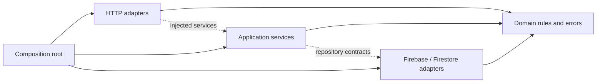

# Architecture

## Standalone error screens

The unknown-route catch-all lives outside the storefront layout. The root render
boundary wraps the entire layout, and the router has an explicit error element;
both use the same themed status screen without exposing exception messages.
Product lookup errors use that screen too. The layout suppresses its visible
chrome when a nested status screen is present. Error pages show only the code,
heading, and explanation, set `noindex`, and focus their heading. Navigating back
to a healthy route resets the render boundary and restores the normal layout.

## Inventory publishing workflow

The deployed browser uses the Firestore adapter in `frontend/src/shared/firestore/store.ts`.
Published records live in `products`; drafts and archives live in the admin-only
`productWorkspace` collection. Existing records without `status` remain published.
Publishing and archiving atomically move a record and update its public slug mapping.
Restoring an archive returns it to drafts. Permanent deletion is offered only for
archives. Empty or deleted public records no longer fall back to seed products;
the existing one-time admin bootstrap remains responsible for seeding.

The admin queries have separate caches from the storefront. Product mutations
invalidate both. Inventory filters and pagination are in the URL, selection is
limited to visible rows, and bulk changes run in bounded groups with individual
failure reporting and retry. These are independent per-product transactions, not
an all-or-nothing transaction for the entire selection.

Products support a cover plus up to five additional images. Uploaded images keep
the existing immutable SHA-256 image documents and 300 KB per-file limit. The
product and all new image references are committed in the same transaction.
The storefront gallery shows actual photos instead of alternate crops.

The Node HTTP API remains the legacy single-image interface; the deployed inventory
workflow uses the browser Firestore adapter. New publishing operations are not
exposed through the Node HTTP API. Deploy the generated Firestore rules before
the updated frontend so private inventory queries and gallery writes are allowed.

Planto has two runtime boundaries: a React browser application and a Node.js HTTP
server backed by Firestore Standard. The root package manages a single installation
and deployment; frontend and backend source never import each other.

## Layout

```text
.env                         One local configuration file, ignored by Git
.env.example                 Portable configuration template
frontend/
  src/
    main.tsx                 Browser entry point
    app/                     Providers, routing and store composition
    pages/                   Route screens
    widgets/                 Header, footer, home sections, reusable not-found view
    features/                Admin access, cart drawer, product form, filters, newsletter
    entities/                Product, category, review, cart types/state/UI
    shared/                  UI primitives, HTTP client, Firebase configuration, i18n
  public/                    Static images, icons and robots.txt
backend/
  src/
    server.js                Process startup and graceful shutdown
    bootstrap.js             Composition root: constructs and connects dependencies
    config.js                Validates explicitly supplied environment values
    domain/                  Validation, product rules, image decoding, error codes
    application/             Use cases with injected repository/auth dependencies
    infrastructure/          Firebase token verifier and Firestore REST adapters
    http/                    Routing, request parsing, CORS, error mapping, static files
  seed.json                  Initial catalog data
  firestore.rules.template   Versioned Firestore rules without account values
  firestore.rules            Generated local rules; ignored by Git
scripts/                     Development, architecture checks and maintenance tools
docs/                        Design reference and CI workflow template
```

## Backend dependencies


```mermaid
flowchart LR
  HTTP[HTTP adapters] --> Domain[Domain rules and errors]
  Root[Composition root] --> HTTP
  Root --> Services[Application services]
  Root --> Infrastructure[Firebase / Firestore adapters]
  Services --> Domain
  Infrastructure --> Domain
  HTTP -. injected services .-> Services
  Services -. repository contracts .-> Infrastructure
```

Solid arrows are source imports; dotted arrows are dependencies passed at startup.
Application services know repository operations, not Firebase URLs, document encodings,
HTTP status codes, or global configuration. See `backend/src/application/README.md` for
repository contracts. Small factory functions implement dependency injection without
an additional framework or a hierarchy of base classes.

- **Domain** validates product fields and images, derives slugs, and selects catalog results.
  It has no network, filesystem, environment, HTTP or Firebase dependency.
- **Application** owns CRUD workflows, category checks, unique slug selection, newsletter
  normalization, administrator authorization and one-time catalog initialization.
- **Infrastructure** verifies Firebase tokens and implements Firestore repositories.
  Product/slug writes use atomic commits with existence and version preconditions.
- **HTTP** translates request bodies/query strings into service calls and maps stable
  application error codes into responses. Unexpected errors expose no raw dependency data.
- **Bootstrap** is the only place that chooses concrete implementations. Importing a
  service does not initialize Firebase, read `.env`, load seeds, or start a server.

The public catalog is read without credentials. Admin requests carry a Firebase ID token:
Node verifies the token and allowlist, then forwards it to Firestore, where rules enforce
access independently. There is no service-account file or automatic Firebase login.

`GET /api/admin/me` only checks access. After a manual sign-in, the browser calls
`POST /api/admin/session`; this verifies access and initializes sample data once.
A completion marker prevents future logins from restoring deleted sample products.
Concurrent initialization within a server instance shares one promise; failed attempts
can retry, and create-if-absent writes permit safe continuation after a partial failure.

## Frontend dependencies and state

The header's full navigation uses the shared modal primitive as a side panel on
desktop and mobile. Its link list scrolls independently; the close control and
account/language footer stay visible. The shared modal owns scroll locking,
focus trapping, Escape/backdrop dismissal and focus restoration.

```text
app -> pages -> widgets -> features -> entities -> shared
```

Imports go downward. Independent slices within pages, widgets, features and entities
cannot import one another; compose them in a higher layer. `app` and `shared` may use
internal modules. Public slice exports expose UI, hooks and types; heavy schema modules
are imported directly only by consumers that need runtime validation.

RTK Query owns server data and invalidation. Product changes are never copied into a
second Redux slice or localStorage. The cart slice owns browser cart state and persists
only cart lines. Browser listeners and persistence subscriptions attach after provider mount
and are disposed on unmount. Catalog filters live in the URL; language preferences live in i18n and
browser storage. Frontend validation gives immediate form feedback; the backend validates
all writes independently.

Firebase authentication and analytics load on demand. Authentication uses in-memory
persistence and a user-initiated Google popup. Production code has no test-mode branches
or mock server startup.

EN/RU translations live in `frontend/src/shared/i18n/locales`. All visible UI text uses
translation keys, and reusable UI components receive their labels as props. Design tokens
remain in `frontend/src/index.css`; the design reference is in `docs/design-reference.md`.

## Configuration and deployment

The single root `.env` is loaded by Node startup and Vite. Only `VITE_*` variables enter
the browser; Firebase web configuration is public. Admin email allowlists and server
settings are unprefixed. The checked-in `.env.example` contains placeholders.

`npm run rules:generate` writes ignored `backend/firestore.rules` from `.env`; publish
that file manually in Firebase Console after an allowlist/rules change. Local code
changes do not automatically publish cloud rules.

`npm run build` writes `frontend/dist`. `npm start` serves the API and this frontend
from one origin. Vite proxies `/api` during development. Deploying only static assets
requires a separately deployed API and reverse proxy.

## Verification and enforcement

- `npm run lint`: ESLint, architectural boundaries, and EN/RU key parity.
- `npm run check:architecture`: rejects upward/cross-slice frontend imports, forbidden
  backend layer imports, cross-runtime imports and production imports of test helpers.
- `npm run build`: strict TypeScript checks and production bundling.
- `npm run check`: lint and build together, including translation and type checks.

Automated test suites, fixtures, runners and reports were removed at the user's request.
Changed browser flows require manual verification. Build checks do not verify published
Firebase rules or a real Google popup in the deployed environment.

## Current tradeoffs

The catalog repository loads all products before bilingual substring filtering and
pagination. This is suitable for the current small catalog. Larger catalogs need indexed
query/search infrastructure and cursor pagination behind the existing repository boundary.

Uploaded images are limited to 300 KB, stored as Firestore bytes, and identified by SHA-256.
The hash is a content identifier; it cannot replace image bytes. External image URLs use
HTTPS. Unreferenced uploaded images are retained; cleanup needs a deliberate retention policy.

The backend and frontend intentionally have separate validation ownership. Browser rules
help users; server validation and Firestore rules remain authoritative. This application
uses one root package because it deploys as one service; separate package workspaces can
be introduced if the runtimes gain independent release cycles.

## Decisions from this review

1. Replace global backend clients with factory-based services and repositories to isolate
   business logic from Firebase and environment values.
2. Keep error codes in the domain and HTTP statuses in the HTTP adapter.
3. Remove the unused pre-migration UI, duplicate Redux filter state and mock worker assets.
4. Enforce both runtime boundaries and keep mock implementations out of production.
5. Move seed side effects to an authenticated POST while retaining manual sign-in behavior.
6. Keep runtime code separate from development tooling; use lint and build as the current checks.

## Demo checkout

`/cart` reviews quantities and current availability; `/checkout` collects sample details and presents an editable review; `/checkout/confirmation` shows a clearly labeled demo receipt. No payment or real order is submitted. Names, email and addresses stay in component state and are never persisted or transmitted. A validated session receipt contains only a demo reference, item count, total and delivery choice; it survives refresh in the current tab.

Basket products are fetched by their IDs through the product API rather than a paginated catalog subset. Checkout rechecks prices and availability before confirming. Missing or unavailable products block confirmation. Confirmation clears the basket only after the demo receipt is saved.

### September 2026 storefront prices

The six original catalog prices are now 15–70 AZN. Both seeds use these prices.
The Firestore reader normalizes only the six exact legacy slug/price pairs before
filtering, sorting and checkout. Other products and subsequent merchant price
edits are preserved. This provides consistent storefront pricing without a
privileged database migration; the existing raw legacy records are unchanged.

Reference comparables: Gullerim cactus listings (https://www.gullerim.az/product-categories/kaktus),
Gullerim houseplants (https://gullerim.az/product-categories/bitkiler),
and a Baku Calathea listing (https://prayk.com/az/elan/benjamim-kalathea-difenbaxiya-bitkileri-1766177).
Prices are chosen retail prices based on comparables, not identical-size valuations.
Checkout remains a local basket confirmation; it does not submit an order or payment.

## Browser-only garden experiences

The `garden` entity stores only saved/compared product IDs and care checkmark keys.
The app composes its Redux reducer and persistence lifecycle; product details still
come from RTK Query. `garden-tools` supplies actions through ProductCard's tools slot,
keeping entities independent. Comparison is bounded to three products.

The lazy `/discover`, `/finder`, `/wishlist`, `/compare` and `/studio` pages compose
these features. Quiz/compare profiles are explicitly illustrative catalog metadata.
The care calendar records soil-check dates locally and makes no real watering promises.
The checkout slice also owns `/tracking`: a labelled simulation using a session receipt,
with manual stages or a cancellable timer. No order, payment, address, or delivery is
submitted. Room/pot styling is cosmetic and leaves product prices unchanged.

## Interactive botanical sculpture

The home widget lazy-loads Three.js when its canvas approaches the viewport.
`widgets/home/lib/botanical-model.ts` owns the original curved leaf geometry,
ceramic bowl, and instanced stones. `botanical-scene.ts` owns rendering, drag and
keyboard rotation, lighting, growth, rain, and GPU resource disposal. React owns
only the control state, with no per-frame component updates or server writes.
Vertical touch gestures and wheel events remain available to page scrolling.
Rendering stops off screen or in hidden tabs; paused/reduced-motion modes render
only control changes. Device pixel ratio is capped at 1.5. Context loss or a failed
WebGL import shows a static existing plant image and a retry action.

## Navigation and page structure

`shared/config/navigation.ts` defines the task vocabulary reused by the desktop
header, menu and footer: shopping tools, interactive experiences, and help/care.
Login appears only in the menu footer. Desktop disclosures support hover, click,
keyboard opening, Escape and outside-click dismissal. The mobile bottom bar
exposes Home, Shop, Explore and Basket and reserves space for safe-area insets;
it is hidden for checkout, admin, dialogs, input focus and standalone errors.
`widgets/site-navigation` owns contextual page trails and mobile navigation.
Catalog product links carry a validated local return URL in router state, keeping
filters when the visitor follows the Shop plants trail back from a product.
`app/router/route-anchor.tsx` resolves section links after lazy content appears,
including cross-page links into the 3D world and care calendar. RouteAnnouncer
leaves hash navigation to that handler. All existing page URLs remain valid.
The Explore hub groups interactive experiences and helper tools; shopping lists
live in the catalog/menu. Home introduces products before the exploration sections.

### Focused-page footer policy

The storefront footer is omitted on admin routes, basket, checkout and confirmation,
order tracking, comparison, plant finder and room studio. Browsing and information
pages retain it. AppLayout owns the route policy; standalone errors and the film
already use their own layouts. Main fills the remaining viewport instead of reserving
a second viewport below the header. The signed-out admin gate reduces decorative
artwork at short viewport heights so its controls fit without locking page scrolling
or clipping content when accessibility settings require extra space.

### Optional plant companion

`entities/companion` owns validated, browser-persisted preferences (visibility,
personality, pot and motion), plus transient reaction/dialog state. Store listener
middleware reacts to basket additions; Room Studio dispatches a reaction for manual
plant/room changes. `widgets/plant-companion` handles route peeking, local-time sleep,
accessible settings and the lightweight animated character. Only preferences persist;
reactions expire after 4.5 seconds. No server writes, audio or external requests are
used. The companion is suppressed during admin, basket and checkout flows, errors,
other dialogs and focused text inputs. It respects reduced motion and pauses character
animation in background tabs. The menu can restore a hidden companion.

The companion launcher supports mouse, pen and touch dragging with pointer capture
and a movement threshold that distinguishes dragging from opening settings. Its
normalized position persists with preferences and is clamped to the viewport above
the mobile navigation. Arrow keys move the focused launcher; Home resets it. The
floating dismiss icon is removed; the existing hide option remains in settings.

Pip snaps to one of four safe viewport corners on release (including legacy saved positions). Arrow keys switch corners. Notifications never reposition Pip. When Pip occupies a lower corner, CSS places toast notifications below the header at the top center; with Pip in an upper corner, notifications keep their bottom placement.

Corner switching uses a 14px directional gesture, moving only on release rather than requiring a drag past the viewport midpoint. Each gesture switches once; release saves the corner, cancellation restores it, and reduced motion disables the slide.


While held, Pip follows the pointer within safe viewport bounds without a transition. Releasing a directional drag of at least 14px slides to the corresponding corner; smaller drags return to the original corner.


The app uses ToastProvider in headless mode: it retains message state and expiry, while PlantCompanion presents every queued notification as an accessible speech bubble with per-message dismissal and success/error reactions. Notifications temporarily reveal Pip even if disabled or on an excluded route, without changing preferences. Separate toast boxes are not rendered.

Desktop navigation owns one shared active dropdown, scoped to the route; delayed close callbacks only close their own menu. Identical notification text and tone reuse one message and refresh its expiry, preventing repeated basket clicks from stacking duplicate speech bubbles.

Pip notifications now use latest-only delivery: each new message replaces its predecessor, gets a fresh expiry timer, and disappears automatically (including errors). Speech bubbles have no dismiss control and older messages never reappear.
