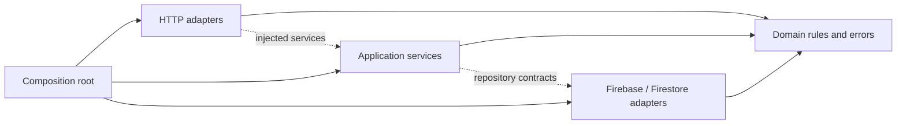

# Architecture

Planto has two runtime boundaries: a React browser application and a Node.js HTTP
server backed by Firestore Standard. The root package manages a single installation
and deployment; frontend and backend source never import each other.

## Layout

```text
.env                         One local configuration file, ignored by Git
.env.example                 Portable configuration template
frontend/
  src/
    main.tsx                 Browser entry point
    app/                     Providers, routing and store composition
    pages/                   Route screens
    widgets/                 Header, footer, home sections, reusable not-found view
    features/                Admin access, cart drawer, product form, filters, newsletter
    entities/                Product, category, review, cart types/state/UI
    shared/                  UI primitives, HTTP client, Firebase configuration, i18n
  public/                    Static images, icons and robots.txt
backend/
  src/
    server.js                Process startup and graceful shutdown
    bootstrap.js             Composition root: constructs and connects dependencies
    config.js                Validates explicitly supplied environment values
    domain/                  Validation, product rules, image decoding, error codes
    application/             Use cases with injected repository/auth dependencies
    infrastructure/          Firebase token verifier and Firestore REST adapters
    http/                    Routing, request parsing, CORS, error mapping, static files
  seed.json                  Initial catalog data
  firestore.rules.template   Versioned Firestore rules without account values
  firestore.rules            Generated local rules; ignored by Git
scripts/                     Development, architecture checks and maintenance tools
docs/                        Design reference and CI workflow template
```

## Backend dependencies


```mermaid
flowchart LR
  HTTP[HTTP adapters] --> Domain[Domain rules and errors]
  Root[Composition root] --> HTTP
  Root --> Services[Application services]
  Root --> Infrastructure[Firebase / Firestore adapters]
  Services --> Domain
  Infrastructure --> Domain
  HTTP -. injected services .-> Services
  Services -. repository contracts .-> Infrastructure
```

Solid arrows are source imports; dotted arrows are dependencies passed at startup.
Application services know repository operations, not Firebase URLs, document encodings,
HTTP status codes, or global configuration. See `backend/src/application/README.md` for
repository contracts. Small factory functions implement dependency injection without
an additional framework or a hierarchy of base classes.

- **Domain** validates product fields and images, derives slugs, and selects catalog results.
  It has no network, filesystem, environment, HTTP or Firebase dependency.
- **Application** owns CRUD workflows, category checks, unique slug selection, newsletter
  normalization, administrator authorization and one-time catalog initialization.
- **Infrastructure** verifies Firebase tokens and implements Firestore repositories.
  Product/slug writes use atomic commits with existence and version preconditions.
- **HTTP** translates request bodies/query strings into service calls and maps stable
  application error codes into responses. Unexpected errors expose no raw dependency data.
- **Bootstrap** is the only place that chooses concrete implementations. Importing a
  service does not initialize Firebase, read `.env`, load seeds, or start a server.

The public catalog is read without credentials. Admin requests carry a Firebase ID token:
Node verifies the token and allowlist, then forwards it to Firestore, where rules enforce
access independently. There is no service-account file or automatic Firebase login.

`GET /api/admin/me` only checks access. After a manual sign-in, the browser calls
`POST /api/admin/session`; this verifies access and initializes sample data once.
A completion marker prevents future logins from restoring deleted sample products.
Concurrent initialization within a server instance shares one promise; failed attempts
can retry, and create-if-absent writes permit safe continuation after a partial failure.

## Frontend dependencies and state

The header's full navigation uses the shared modal primitive as a side panel on
desktop and mobile. Its link list scrolls independently; the close control and
account/language footer stay visible. The shared modal owns scroll locking,
focus trapping, Escape/backdrop dismissal and focus restoration.

```text
app -> pages -> widgets -> features -> entities -> shared
```

Imports go downward. Independent slices within pages, widgets, features and entities
cannot import one another; compose them in a higher layer. `app` and `shared` may use
internal modules. Public slice exports expose UI, hooks and types; heavy schema modules
are imported directly only by consumers that need runtime validation.

RTK Query owns server data and invalidation. Product changes are never copied into a
second Redux slice or localStorage. The cart slice owns browser cart state and persists
only cart lines. Browser listeners and persistence subscriptions attach after provider mount
and are disposed on unmount. Catalog filters live in the URL; language preferences live in i18n and
browser storage. Frontend validation gives immediate form feedback; the backend validates
all writes independently.

Firebase authentication and analytics load on demand. Authentication uses in-memory
persistence and a user-initiated Google popup. Production code has no test-mode branches
or mock server startup.

EN/RU translations live in `frontend/src/shared/i18n/locales`. All visible UI text uses
translation keys, and reusable UI components receive their labels as props. Design tokens
remain in `frontend/src/index.css`; the design reference is in `docs/design-reference.md`.

## Configuration and deployment

The single root `.env` is loaded by Node startup and Vite. Only `VITE_*` variables enter
the browser; Firebase web configuration is public. Admin email allowlists and server
settings are unprefixed. The checked-in `.env.example` contains placeholders.

`npm run rules:generate` writes ignored `backend/firestore.rules` from `.env`; publish
that file manually in Firebase Console after an allowlist/rules change. Local code
changes do not automatically publish cloud rules.

`npm run build` writes `frontend/dist`. `npm start` serves the API and this frontend
from one origin. Vite proxies `/api` during development. Deploying only static assets
requires a separately deployed API and reverse proxy.

## Verification and enforcement

- `npm run lint`: ESLint, architectural boundaries, and EN/RU key parity.
- `npm run check:architecture`: rejects upward/cross-slice frontend imports, forbidden
  backend layer imports, cross-runtime imports and production imports of test helpers.
- `npm run build`: strict TypeScript checks and production bundling.
- `npm run check`: lint and build together, including translation and type checks.

Automated test suites, fixtures, runners and reports were removed at the user's request.
Changed browser flows require manual verification. Build checks do not verify published
Firebase rules or a real Google popup in the deployed environment.

## Current tradeoffs

The catalog repository loads all products before bilingual substring filtering and
pagination. This is suitable for the current small catalog. Larger catalogs need indexed
query/search infrastructure and cursor pagination behind the existing repository boundary.

Uploaded images are limited to 300 KB, stored as Firestore bytes, and identified by SHA-256.
The hash is a content identifier; it cannot replace image bytes. External image URLs use
HTTPS. Unreferenced uploaded images are retained; cleanup needs a deliberate retention policy.

The backend and frontend intentionally have separate validation ownership. Browser rules
help users; server validation and Firestore rules remain authoritative. This application
uses one root package because it deploys as one service; separate package workspaces can
be introduced if the runtimes gain independent release cycles.

## Decisions from this review

1. Replace global backend clients with factory-based services and repositories to isolate
   business logic from Firebase and environment values.
2. Keep error codes in the domain and HTTP statuses in the HTTP adapter.
3. Remove the unused pre-migration UI, duplicate Redux filter state and mock worker assets.
4. Enforce both runtime boundaries and keep mock implementations out of production.
5. Move seed side effects to an authenticated POST while retaining manual sign-in behavior.
6. Keep runtime code separate from development tooling; use lint and build as the current checks.

## Demo checkout

`/cart` reviews quantities and current availability; `/checkout` collects sample details and presents an editable review; `/checkout/confirmation` shows a clearly labeled demo receipt. No payment or real order is submitted. Names, email and addresses stay in component state and are never persisted or transmitted. A validated session receipt contains only a demo reference, item count, total and delivery choice; it survives refresh in the current tab.

Basket products are fetched by their IDs through the product API rather than a paginated catalog subset. Checkout rechecks prices and availability before confirming. Missing or unavailable products block confirmation. Confirmation clears the basket only after the demo receipt is saved.

### September 2026 storefront prices

The six original catalog prices are now 15–70 AZN. Both seeds use these prices.
The Firestore reader normalizes only the six exact legacy slug/price pairs before
filtering, sorting and checkout. Other products and subsequent merchant price
edits are preserved. This provides consistent storefront pricing without a
privileged database migration; the existing raw legacy records are unchanged.

Reference comparables: Gullerim cactus listings (https://www.gullerim.az/product-categories/kaktus),
Gullerim houseplants (https://gullerim.az/product-categories/bitkiler),
and a Baku Calathea listing (https://prayk.com/az/elan/benjamim-kalathea-difenbaxiya-bitkileri-1766177).
Prices are chosen retail prices based on comparables, not identical-size valuations.
Checkout remains a local basket confirmation; it does not submit an order or payment.

## Browser-only garden experiences

The `garden` entity stores only saved/compared product IDs and care checkmark keys.
The app composes its Redux reducer and persistence lifecycle; product details still
come from RTK Query. `garden-tools` supplies actions through ProductCard's tools slot,
keeping entities independent. Comparison is bounded to three products.

The lazy `/discover`, `/finder`, `/wishlist`, `/compare` and `/studio` pages compose
these features. Quiz/compare profiles are explicitly illustrative catalog metadata.
The care calendar records soil-check dates locally and makes no real watering promises.
The checkout slice also owns `/tracking`: a labelled simulation using a session receipt,
with manual stages or a cancellable timer. No order, payment, address, or delivery is
submitted. Room/pot styling is cosmetic and leaves product prices unchanged.
